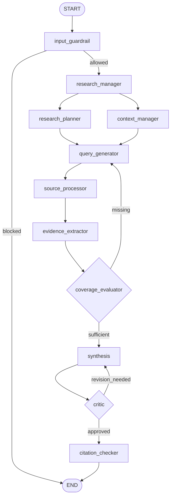

# Research Desk — AI Research Agent (Next.js + LangGraph.js)

A multi-agent research system built with **LangGraph.js** inside a **Next.js 16** app.
You give it a research question. It plans sub-questions, searches the web, your private
documents and external APIs, checks whether it has enough evidence (looping if not),
writes a cited Markdown report, critiques its own draft, and verifies every citation.

This is the TypeScript build of the "AI Research Agent: A LangGraph Multi-Agent System for
Autonomous Research" guide. A Python version will follow the same structure.

---

## Quick start

```bash
npm install
cp .env.example .env.local        # add an LLM key and (ideally) TAVILY_API_KEY
npm run dev                       # http://localhost:3000
```

Requirements: Node 20.9+. `better-sqlite3` is a native module. On Linux it installs a prebuilt
binary; if it has to compile, you need `build-essential` and `python3`.

Minimum keys: one LLM provider key. Tavily is recommended. Without it, web search falls back to
SerpAPI or Brave if you have keys for them, and otherwise to DuckDuckGo (no key needed, snippets only).

Other scripts:

| Command | What it does |
| --- | --- |
| `npm run test:graph` | Runs the real graph offline with a scripted model. Checks both loops, the caps, the guardrail, private-doc retrieval, memory and the citation checker. No keys needed. |
| `npm run typecheck` | TypeScript check |
| `npm run build && npm start` | Production build |

---

## The pipeline



`GET /api/config` also returns the compiled graph as Mermaid. It comes from LangGraph's own
`drawMermaid()`, so it always matches the code.

## Where each part of the guide lives

| Guide section | File |
| --- | --- |
| §1.2 API keys | `.env.example`, `src/lib/config.ts` |
| §3 `ResearchState` + reducers | `src/lib/agent/state.ts` |
| §4.1 Research Manager | `src/lib/agent/nodes/manager.ts` |
| §4.2 Research Planner | `src/lib/agent/nodes/planner.ts` |
| §4.3 Context Manager | `src/lib/agent/nodes/context.ts` |
| §4.4 Query Generator | `src/lib/agent/nodes/queries.ts` |
| §4.5 Source Processor (3 channels) | `src/lib/agent/nodes/sources.ts`, `src/lib/retrieval/{web,docs,apis}.ts` |
| §4.6 Evidence Extractor + Store | `src/lib/agent/nodes/extractor.ts`, `mergeEvidence` in `state.ts` |
| §5 Coverage Evaluator + loop | `src/lib/agent/nodes/coverage.ts` |
| §6.1 Synthesis | `src/lib/agent/nodes/synthesis.ts` |
| §6.2 Critic | `src/lib/agent/nodes/critic.ts` |
| §6.3 Citation Checker | `src/lib/agent/nodes/citations.ts` |
| §7 StateGraph, edges, routing, compile | `src/lib/agent/graph.ts` |
| §7.6 SQLite checkpointer (`thread_id`) | `src/lib/agent/graph.ts` (`SqliteSaver`) |
| §9.1 Input guardrail | `src/lib/agent/nodes/guardrail.ts` |
| §9.2 Tracing | Set `LANGSMITH_TRACING=true` and `LANGSMITH_API_KEY`. No code needed. |
| §9.3 Iteration limits | `coverage.ts` (research loop), `critic.ts` (revision loop) |
| §9.4 Tool errors + fallbacks | `retrieval/web.ts` (Tavily → SerpAPI → Brave → DuckDuckGo), `ToolError` records |
| §9.5 Selective storage + long-term memory | `mergeEvidence` (threshold, dedupe, eviction), `reports` table in `src/lib/db.ts` |
| §9.6 Tool hygiene | Planning and evaluation nodes have no tools; only the Source Processor retrieves |

## Design decisions worth knowing

**Two model tiers.** The guide says the Research Manager should use a higher-capability model.
The "smart" tier runs the reasoning-heavy agents. The "fast" tier runs the guardrail, query
writing and evidence scoring, which are high-volume and cheap. Change either one in `.env.local`.

**The evidence-store reducer does the selective storage.** The guide's `operator.add` only
appends. Here the reducer appends and also drops chunks below `MIN_RELEVANCE`, merges
near-duplicate passages (keeping the higher score), and evicts the lowest scores past
`MAX_EVIDENCE`. Because it's the reducer, these rules apply to every write, including evidence
re-used from memory.

**Per-run state is reset with `Overwrite`.** The checkpointer keeps state between runs on the same
`thread_id`, so without a reset a second question would inherit the first run's evidence. The
Research Manager returns `new Overwrite([])` for the append-style fields.

**Both loops are capped.** The guide caps the research loop but not the Critic → Synthesis loop.
Both are capped here (`MAX_RESEARCH_ITERATIONS`, `MAX_REVISIONS`). When a cap is hit, the report
gets an honest note under "Research notes" saying so.

**The model never writes the Sources section.** Synthesis cites evidence as `[n]`. The Citation
Checker suggests exact text edits to fix citations and flags claims it can't trace. Then code
removes citation numbers that don't exist and builds the Sources list from the evidence that's
actually cited. A source URL in the report can't be made up.

**Failures are data.** Every tool call is wrapped. A failed search, API call or model call becomes
a `ToolError` in state, and the run continues with what it has. Each LLM-backed node also has a
fallback (for example, the Query Generator searches the raw sub-questions if its model call fails).

**Memory.** Each finished report is saved with its evidence. On the next run, the Context Manager
loads recent reports from the same thread plus relevant ones from other threads (ranked by BM25).
It puts their summaries in context and re-uses their best evidence chunks directly.

**Private docs use BM25.** Uploaded PDF/DOCX/TXT/MD files are chunked (about 1,000 characters with
overlap) and ranked with BM25. No embedding API key is needed. To try hybrid retrieval, swap
`searchDocs` in `src/lib/retrieval/docs.ts` for a dense or hybrid retriever.

## Extending it

- **Add a search provider:** add an entry to `REGISTRY` in `src/lib/retrieval/web.ts` and list it in `SEARCH_PROVIDERS`.
- **Add an API source:** write an `ApiAdapter` in `src/lib/retrieval/apis.ts` that returns `{title, url, content}[]`.
- **Connect an MCP server:** set `MCP_SERVER_URL`, `MCP_TOOL_NAME` and `MCP_QUERY_ARG`. The adapter calls that tool over Streamable HTTP for every API query.
- **Add state fields** (the guide suggests `source_reliability_scores`, `report_format`, `language`): add them to `ResearchState` in `state.ts`. Every node can then read them.

## Project layout

```
src/
  app/
    api/research/route.ts      POST → Server-Sent Events, one event per agent step
    api/documents/…            upload / delete private documents
    api/threads/…              list threads, load a thread's reports and documents
    api/config/route.ts        active config (no secrets) + Mermaid graph
    page.tsx, layout.tsx, globals.css
  components/
    ResearchApp.tsx            app shell, SSE client, threads, uploads
    TraceRail.tsx              live agent pipeline with both loops
    ReportView.tsx             report, evidence and run-log tabs
  lib/
    agent/                     state, graph, run helper, nodes/
    retrieval/                 web (with fallbacks), docs (BM25), apis (Wikipedia, arXiv, MCP)
    config.ts, llm.ts, db.ts, text.ts
scripts/test-graph.ts          offline end-to-end test
data/                          SQLite files (created at runtime, git-ignored)
```

## Deployment notes

The app uses local SQLite files and runs long requests (up to `maxDuration = 300` seconds), so
host it on a server that runs Node: a VPS with PM2 behind Nginx, or Docker. Serverless platforms
don't keep local files between requests. To go serverless, switch to the Postgres checkpointer
(`@langchain/langgraph-checkpoint-postgres`) and move `db.ts` to Postgres. For Nginx, disable
buffering on `/api/research` so the stream reaches the browser in real time. The route already
sends `X-Accel-Buffering: no`.
